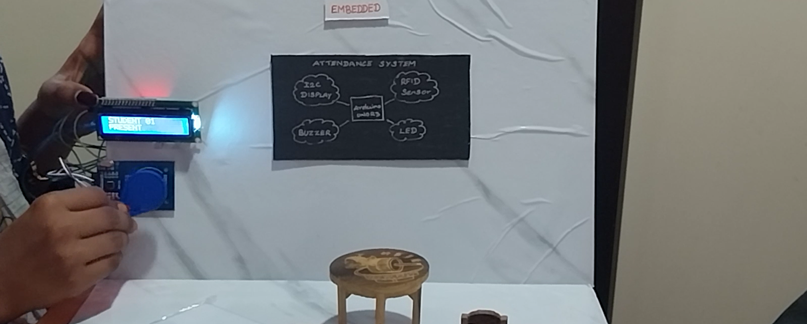

# rfid-attendance-system
RFID-based attendance system using Arduino and RFID RC522 for automated user identification and attendance tracking.
# RFID Attendance System

## Project Overview

Developed an RFID-based attendance system using Arduino and RFID RC522 to automate user identification and attendance recording.

## Components Used

- Arduino Uno
- RFID RC522 Module
- RFID Tags/Cards
- LCD Display 
- Jumper Wires

## Features

- RFID card detection
- User authentication
- Automated attendance marking
- Real-time display of attendance status

## Software Used

- Arduino IDE

## Outcome

Successfully implemented an embedded attendance system using RFID technology for secure and efficient attendance management.

## Screenshots

### Circuit Diagram

### RFID Detection

### Working Demo

